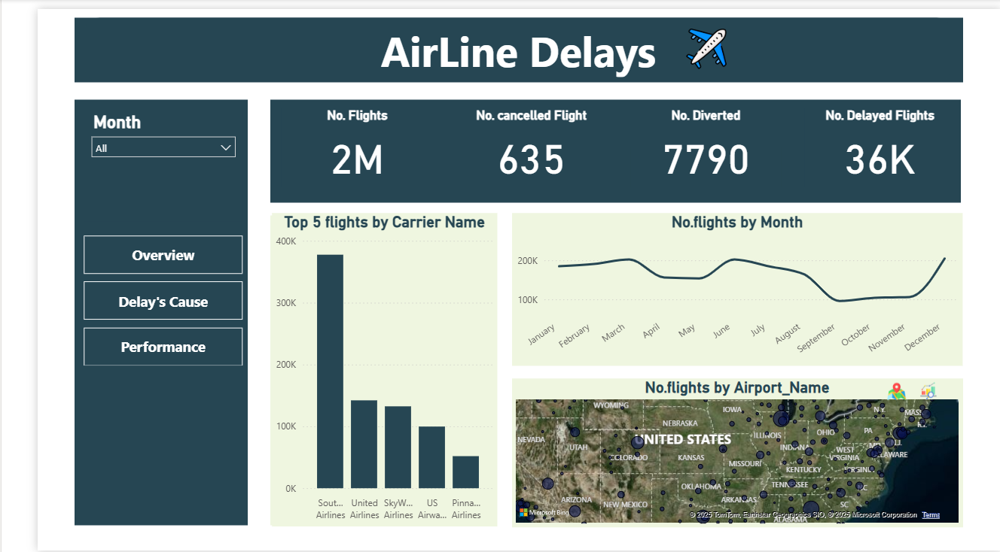
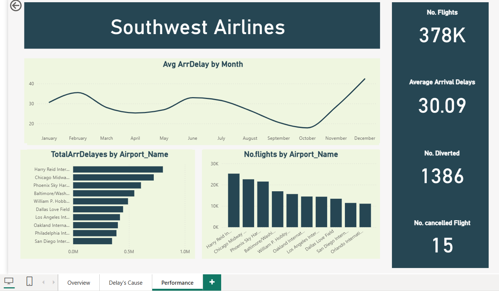

# PowerBI_Airline-Delays-and-Performance-Dashboard

---

### 📘 Project Overview

This Power BI project analyzes airline performance and delay causes across multiple airports and carriers.
The goal was to uncover patterns in flight operations, identify performance bottlenecks, and suggest actionable strategies to reduce delays and cancellations.

---

### ⚠️ Business Challenge

Airlines face frequent operational disruptions due to weather, maintenance, and scheduling issues, leading to high delay percentages and poor customer experience.
The company lacked a clear, consolidated view of these factors to make data-driven improvements.

---

### 💡 Approach

Cleaned and prepared flight data using Power Query and SQL.

Designed a multi-page Power BI dashboard including:

Overview Page: Flight totals, cancellations, diversions, and monthly flight trends.

Delay’s Cause Page: Breakdown of delay reasons (carrier, weather, NASD, security).

Performance Page: Focused analysis for major carriers like Southwest Airlines, showing per-airport delays and flight performance.

Implemented Drill-through pages and interactive tooltips for seamless navigation between carrier-level and airport-level insights.

Used KPIs and visuals (bar, line, and pie charts) to make trends instantly understandable.

---

### 🖼️ Dashboard Overview

Main Insights Across Pages:

Total Flights: 2M

Cancelled Flights: 635

Diverted Flights: 7,790

Delayed Flights: 36K (≈1.8%)

Average Arrival Delay: 42 minutes

Top 5 Carriers: Southwest, United, SkyWest, US Airways, Pinnacle

Main Delay Reasons:

Carrier Delay – 34.2%

Weather Delay – 20.8%

Late Aircraft Delay – 19.6%

NASD Delay – 19.9%

Security Delay – 5.4%

### 💡 The dashboard uses a simple navigation system with Overview, Delay’s Cause, and Performance pages for quick drill-downs and comparisons.

---

### 📊 Key Insights

Southwest Airlines operates over 378K flights yearly but shows an average arrival delay of 30 minutes.

Weather and carrier-related issues account for over 55% of total delays.

Delays peak during summer months (June–August) and drop toward the year’s end.

Chicago O’Hare and Hartsfield-Jackson airports have the highest flight traffic and delays.

---

### ✅ Recommendations

Optimize scheduling and turnaround times for carriers with recurring late arrivals.

Invest in weather-delay prediction systems to proactively reroute or reschedule flights.

Improve ground operations to reduce carrier and NASD-related issues.

Monitor airport-specific delay patterns through drill-through pages for data-driven actions.

---

### 🧰 Tools Used

Power BI → Visualization & dashboard creation

Power Query / SQL → Data cleaning & transformation

DAX → KPI calculations and performance metrics

Excel → Initial data exploration

---

### 📺 Dashboard Pages

Overview: Flight summary & operational KPIs 

Delay’s Cause: Root cause analysis of delays 

Performance: Carrier & airport-specific insights 

---

### 🔗 Interactive Dashboard

👉 📊 **Live Dashboard:** [**Click here**](https://app.powerbi.com/reportEmbed?reportId=a2e87ebe-bfc8-4629-8b8a-22c3d0cebe50&autoAuth=true&ctid=1158e2d5-dc24-41ad-abce-62841076dbde) 
 [View on NovyPro](https://project.novypro.com/KrENA5)

---

### 👤 Author
**Raafat Elrais**  
Business Intelligence Developer  

👤 Connect with me on LinkedIn: [Raafat Elrais](https://www.linkedin.com/in/raafat-elrais/)  

💡 #OpenToWork — always open to collaborations, BI projects, and opportunities in **Data Analytics, Visualization, and Business Intelligence.**

---
